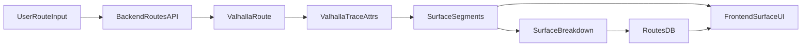

# Valhalla Surface Integration Plan

## Approach

- Adopt Stadia Maps Valhalla endpoints (`https://api.stadiamaps.com/route/v1` and `https://api.stadiamaps.com/trace_attributes/v1`) with API-key auth (query or header) as the primary routing + surface-attribute provider.
- Use Valhalla `trace_attributes` on the routed polyline to derive segment-level surface types, compute route-level breakdowns, and store them in the DB; keep any surface lookups server-side.
- Enforce 6-digit polyline precision for all encode/decode operations to avoid drift and preserve matching quality.

## Key Files to Update

- [`/Users/johnroescher/Desktop/JOHN ROUTER/V1 - Claude Code/backend/app/core/config.py`](/Users/johnroescher/Desktop/JOHN%20ROUTER/V1%20-%20Claude%20Code/backend/app/core/config.py)
- [`/Users/johnroescher/Desktop/JOHN ROUTER/V1 - Claude Code/backend/app/schemas/route.py`](/Users/johnroescher/Desktop/JOHN%20ROUTER/V1%20-%20Claude%20Code/backend/app/schemas/route.py)
- [`/Users/johnroescher/Desktop/JOHN ROUTER/V1 - Claude Code/backend/app/services/routing.py`](/Users/johnroescher/Desktop/JOHN%20ROUTER/V1%20-%20Claude%20Code/backend/app/services/routing.py)
- [`/Users/johnroescher/Desktop/JOHN ROUTER/V1 - Claude Code/backend/app/services/analysis.py`](/Users/johnroescher/Desktop/JOHN%20ROUTER/V1%20-%20Claude%20Code/backend/app/services/analysis.py)
- [`/Users/johnroescher/Desktop/JOHN ROUTER/V1 - Claude Code/backend/app/services/surface_match.py`](/Users/johnroescher/Desktop/JOHN%20ROUTER/V1%20-%20Claude%20Code/backend/app/services/surface_match.py)
- [`/Users/johnroescher/Desktop/JOHN ROUTER/V1 - Claude Code/backend/app/api/routes.py`](/Users/johnroescher/Desktop/JOHN%20ROUTER/V1%20-%20Claude%20Code/backend/app/api/routes.py)
- [`/Users/johnroescher/Desktop/JOHN ROUTER/V1 - Claude Code/frontend/src/components/map/hooks/useSurfaceEnrichment.ts`](/Users/johnroescher/Desktop/JOHN%20ROUTER/V1%20-%20Claude%20Code/frontend/src/components/map/hooks/useSurfaceEnrichment.ts)
- [`/Users/johnroescher/Desktop/JOHN ROUTER/V1 - Claude Code/frontend/src/lib/surfaceEnrichment.ts`](/Users/johnroescher/Desktop/JOHN%20ROUTER/V1%20-%20Claude%20Code/frontend/src/lib/surfaceEnrichment.ts)

## Data Flow (Proposed)

## Implementation Steps

1. **Configuration & Routing Service wiring**

   - Add Stadia Maps config entries for `valhalla_base_url` (US) and `valhalla_api_key` in [`backend/app/core/config.py`](/Users/johnroescher/Desktop/JOHN%20ROUTER/V1%20-%20Claude%20Code/backend/app/core/config.py).
   - Add `VALHALLA` to `RoutingService` enum in [`backend/app/schemas/route.py`](/Users/johnroescher/Desktop/JOHN%20ROUTER/V1%20-%20Claude%20Code/backend/app/schemas/route.py).
   - Implement `_call_valhalla_route()` and `_call_valhalla_trace_attributes()` in [`backend/app/services/routing.py`](/Users/johnroescher/Desktop/JOHN%20ROUTER/V1%20-%20Claude%20Code/backend/app/services/routing.py), including Stadia API key in query or `Authorization: Stadia-Auth <key>` header.

2. **Surface extraction from Valhalla trace attributes**

   - Parse `trace_attributes` response edges using an explicit contract:
     - Prefer `edge.surface` (categorical).
     - Backup: `edge.unpaved` (boolean-ish).
     - Context: `edge.use` (e.g., cycleway/track/footway) to disambiguate paved trail vs unpaved track.
   - Map those fields into existing buckets (`paved`, `gravel`, `ground`, `unpaved`, `unknown`) and avoid deriving surface from `road_class`.
   - Build segment-level `SegmentedSurfaceData` using edge distances from Valhalla and carry `dataQuality` + `qualityMetrics` analogous to current enrichment.
   - If a server-side fallback is required, reuse existing Overpass classification in [`backend/app/services/surface_match.py`](/Users/johnroescher/Desktop/JOHN%20ROUTER/V1%20-%20Claude%20Code/backend/app/services/surface_match.py), but do not call Overpass from the client.

3. **Route-level breakdown & persistence fixes**

   - Extend routing parsing in [`backend/app/services/routing.py`](/Users/johnroescher/Desktop/JOHN%20ROUTER/V1%20-%20Claude%20Code/backend/app/services/routing.py) to return surface breakdowns derived from Valhalla trace attributes.
   - Update analysis flow in [`backend/app/services/analysis.py`](/Users/johnroescher/Desktop/JOHN%20ROUTER/V1%20-%20Claude%20Code/backend/app/services/analysis.py) to accept and normalize Valhalla surface data.
   - Ensure route updates persist surface breakdown when geometry changes in [`backend/app/api/routes.py`](/Users/johnroescher/Desktop/JOHN%20ROUTER/V1%20-%20Claude%20Code/backend/app/api/routes.py).

4. **Frontend enrichment alignment**

   - Update [`frontend/src/components/map/hooks/useSurfaceEnrichment.ts`](/Users/johnroescher/Desktop/JOHN%20ROUTER/V1%20-%20Claude%20Code/frontend/src/components/map/hooks/useSurfaceEnrichment.ts) to rely on backend-enriched segments; if missing, display as `unknown` without a client-side Overpass call.
   - Keep the existing `surfaceEnrichment.ts` cache but limit it to backend results and adjust metadata so Valhalla results are clearly marked as the source.

5. **Validation & testing plan**

   - Add integration tests or fixtures in backend for Valhalla response parsing (route + trace_attributes).
   - Manual test flows: route generation, point-to-point, route update persistence, map coloring, and surface breakdown UI.

## Open Assumptions

- Stadia Maps `trace_attributes` returns enough attributes to infer surface; if not, we will keep Overpass as a server-side fallback for any segment with missing surface coverage.
- API key will be provided and stored in server environment variables.