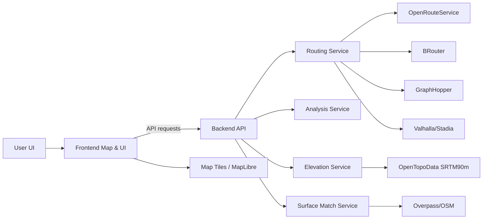
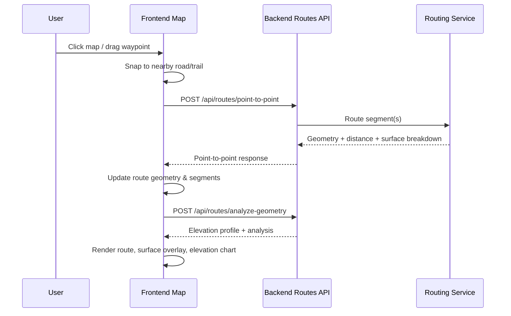
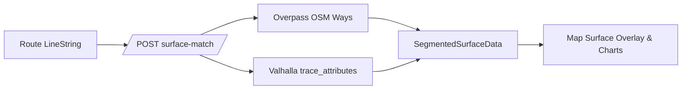
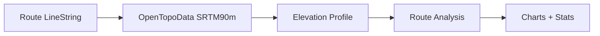

# Routing System Technical Documentation

This document provides a comprehensive, end-to-end description of how routing works across the backend and frontend, including waypoints, segments, snapping, road/trail handling, surface data, elevation, and third‑party services. It is intentionally verbose and structured for deep technical reference.

---

## 1) System Overview

The routing system is a multi-provider pipeline that:

1. Accepts user intent (waypoints and constraints).
2. Snaps coordinates to the road/trail network.
3. Requests routes from external routing engines.
4. Enriches geometry with surface and elevation data.
5. Analyzes, validates, and scores candidates.
6. Returns results for map rendering, UI inspection, and storage.

The system is designed to support multiple sport types (road, gravel, MTB, e‑MTB) and balances data quality with performance using caching, fallbacks, and parallel routing calls.

---

## 2) Core Concepts and Data Shapes

### 2.1 Coordinates and Geometry

- **Coordinate**: `{ lng, lat }` in most schemas.
- **Routing geometry**: GeoJSON `LineString` with coordinates ordered `[lng, lat]`.
- **Route geometry** can optionally include elevation in `[lng, lat, ele]` form.

### 2.2 Waypoints

- **Types** (backend schema): `start`, `end`, `via`, plus POI types like `coffee`, `water`, `restroom`, etc.
- **Storage**: `route_waypoints` table with `idx` (order), `point`, `lock_strength`, and metadata.
- **Frontend usage**: Waypoints are the primary editing handles; moving a waypoint triggers partial route regeneration.

### 2.3 Segments

Segments exist in two layers:

- **Backend segments** (`route_segments`): Persisted geometry with OSM metadata and stats per segment.
- **Frontend segments**: Derived from the overall route geometry by slicing between waypoints for rendering, partial regeneration, and UI.

Segment metadata fields include:

- Distance, elevation gain/loss, grade stats.
- Surface classification (`surface`, `tracktype`, `smoothness`).
- OSM metadata (`osm_way_ids`, `osm_tags`), name, and access flags.
- Confidence and data completeness for quality evaluation.

### 2.4 Surface Data Shapes

The system uses two surface representations:

1. **Segment-level surface data** (`SegmentedSurfaceData`)
   - `segments[]` with `startDistanceMeters`, `endDistanceMeters`, `surfaceType`, `confidence`
   - `dataQuality` (0‑100) and `qualityMetrics` (coverage %, avg confidence, match distance)
2. **Route-level breakdown** (`SurfaceBreakdown`)
   - Percentages for `pavement/gravel/dirt/singletrack/unknown` (frontend)
   - Backend providers use `paved/unpaved/gravel/ground/unknown` and normalize on the client

Normalization is handled in the frontend so backend breakdowns from routing engines
and client-side Overpass enrichment share a common UI representation.

### 2.5 Elevation Profile

The elevation profile is a list of points with:

- `distance_meters` (cumulative)
- `elevation_meters`
- `grade_percent` (clamped to ±40%)
- `coordinate` (lat/lng)

---

## 3) High-Level Architecture

---

## 4) Backend Routing Pipeline (Detailed)

### 4.1 API Surface (Routes API)

Primary endpoints:

- `POST /api/routes/point-to-point`: manual routing between user-supplied coordinates.
- `POST /api/routes/generate`: constraint-driven route generation (loop/out‑and‑back/point‑to‑point).
- `POST /api/routes/analyze-geometry`: analyze a LineString for elevation and stats.
- `POST /api/routes/surface-match`: segment-level surface enrichment.
- `GET /api/routes/{id}/validate`: validate a saved route against constraints.
- `GET /api/routes/{id}/analyze`: recompute analysis for a saved route.

These endpoints orchestrate routing, snapping, surface enrichment, and elevation analysis.

### 4.2 Routing Service Provider Selection

**Policy matrix (sport × route shape × engine):** see [`ROUTER_POLICY_MATRIX.md`](./ROUTER_POLICY_MATRIX.md).

The routing engine is selected per request using:

- The **explicit `routing_service`** in `RouteConstraints` (if provided).
- Otherwise `AUTO`, which prefers trail-capable routers for off‑road sports.

Default selection logic (simplified):

- **MTB/Gravel/e‑MTB** → prefer **BRouter** (better trail coverage).
- **Road** → prefer **ORS**.
- **GraphHopper** and **Valhalla** are available as explicit choices or fallbacks.

Routing profiles are chosen per sport type (e.g., ORS uses `driving-car` for road to allow highways),
with explicit override if `routing_profile` is set.

### 4.3 Route Generation (Loop / Out‑and‑Back / Point‑to‑Point)

The `generate_route()` flow:

1. Determine routing service and profile.
2. For each route type:
   - **Point‑to‑Point**: generate a single candidate.
   - **Out‑and‑Back**: generate a symmetric candidate via out‑and‑back logic.
   - **Loop**: generate multiple candidates (typically 3), each using different bearings.
3. If primary provider fails in `AUTO` mode, fall back to ORS.

Candidates are ranked against user constraints before returning; if no candidates are viable,
the API returns a validation error prompting the user to relax constraints.

Valhalla can be used for loop generation and returns surface data via `trace_attributes` (when configured).

### 4.4 Manual Point‑to‑Point Routing (Interactive)

The `POST /point-to-point` endpoint is tuned for interactive editing:

1. **Input**: a list of coordinates (start, via points, end) and sport type.
2. **Heuristics**:
   - Short two‑point segments are allowed for trail‑to‑road transitions.
   - Long straight lines are rejected as “too simple.”
   - Detours are detected by comparing routed vs direct distance.
3. **Provider strategy**:
   - For off‑road sports, attempt **GraphHopper** and **BRouter** in parallel.
   - If GraphHopper returns a long straight segment or a detour, prefer BRouter.
   - If both fail, fall back to ORS.

This strategy prioritizes low‑latency routing while guarding against overly simplistic geometries or unreasonable detours.

### 4.5 Snapping (Backend)

Snapping is used when raw coordinates appear off‑network:

1. **Overpass query** against `highway` features within a radius.
2. **Progressive radii**: 50m then 150m by default.
3. **Timeouts**: Overpass snapping requests use short timeouts (~3s) to avoid blocking interactive routing.
4. **Sport‑specific filters**:
   - Off‑road: includes `path`, `track`, `cycleway`, `footway`, `bridleway`, etc.
   - Road: includes `cycleway`, `residential`, `primary`, `trunk`, `motorway`, etc.
4. If snapping succeeds, connector segments are optionally injected to preserve the original start/end if the snap distance is within a per‑sport maximum:
   - Off‑road: up to 250m.
   - Road: up to 100m.

If snapping fails, routing continues with original coordinates.

### 4.6 Surface Enrichment (Backend)

`POST /surface-match` returns segment‑level surfaces:

1. Adaptive sampling (30‑70 samples) and buffer sizing based on route length.
2. Overpass queries for nearby ways and tag‑based classification:
   - Uses `surface`, `tracktype`, `mtb:scale`, `highway`.
3. Produces `SegmentedSurfaceData` with coverage and confidence metrics.

Valhalla `trace_attributes` is available as a server‑side source for surface classification when configured.
All Valhalla polyline encode/decode is kept at 6‑digit precision to avoid drift.

Provider‑specific surface signals:

- **ORS**: surface breakdown is parsed from `extra_info.surface` and mapped to internal buckets.
- **BRouter**: builds a surface mix from response metadata and falls back to `unknown` when coverage is too low.
- **Valhalla**: prefers `edge.surface`; falls back to `edge.unpaved` and `edge.use` to disambiguate trail surfaces.

### 4.7 Elevation Analysis (Backend)

Elevation is computed using OpenTopoData (SRTM90m):

1. Fetch elevations in batches (default 100 per request).
2. Build a profile with cumulative distance and grade.
3. Clamp grades to ±40% and ignore sub‑5m grade deltas.

Elevation stats include:

- Total gain/loss
- Min/max elevation
- Avg grade
- Steepest 100m and 1km windows
- Longest climb, climbing above 8%

### 4.8 Route Analysis (Backend)

The analysis service combines:

- Elevation stats
- Surface breakdown
- MTB difficulty breakdown (green/blue/black/double_black)
- Hike‑a‑bike counts and distance
- Estimated time (distance + elevation + surface factors)
- Confidence score and data completeness

### 4.9 Validation (Backend)

Validation checks ensure routes conform to constraints:

- Connectivity (gap detection)
- Legal access (bicycle legality)
- Safety (steep grades, high‑speed roads)
- Surface constraints (avoid/prefer/require)
- MTB difficulty matching
- Constraint satisfaction (distance, elevation, time)

Validation results include severity and suggested mitigations.

### 4.10 Persistence

Routes are stored with:

- Geometry (PostGIS `LINESTRING`)
- Surface breakdown (JSONB)
- Difficulty ratings and MTB breakdown
- Validation status and issues

Segment‑level metadata is stored in `route_segments` when available. Waypoints are stored in `route_waypoints`.

On route creation, analysis results (including surface breakdown) are persisted. On geometry updates,
distance/elevation/confidence are updated, but surface breakdown persistence depends on whether analysis
re-writes it in the update path.

---

## 5) Frontend Routing Pipeline (Detailed)

### 5.1 Map Core and State

The map UI is built with:

- **MapLibre GL** via `react-map-gl/maplibre`
- **Zustand stores** for route, surface, UI, and preferences

Core component: `MapCore.tsx`

### 5.2 Waypoints and Route Editing

Waypoints are managed in `routeStore`:

- `start`, `viaPoints[]`, `end`
- Undo/redo stacks for manual edits
- Insert/move/remove operations

Edits trigger **partial regeneration** so only affected segments are re‑routed.

### 5.3 Frontend Snapping

Snapping is performed on the client for immediate feedback:

1. Query rendered map features around the cursor.
2. Expand search radii: 8px → 16px → 32px → 64px.
3. Filter for road/trail classes.
4. Snap to the nearest point on the closest line segment.

This is used for:

- Map clicks (new waypoints)
- Dragged waypoint updates

### 5.4 Partial Route Regeneration

`useRouteRegeneration`:

- Splits geometry into segments between waypoints.
- Re‑routes only the affected section (insert/move/remove).
- Runs up to 4 concurrent routing requests for efficiency.
- Shows optimistic segments while waiting for responses.

### 5.5 Surface Enrichment and Overlays

`useSurfaceEnrichment`:

1. Calls backend `/surface-match`.
2. If missing, falls back to client-side Overpass enrichment.
3. Stores `segmentedSurface` in `surfaceStore`.

Surface rendering:

- If `dataQuality > 20`, segments are colored as paved/unpaved/unknown.
- Breakdown charts use aggregated segment data.
- Manual surface breakdown overrides are only applied when `dataQuality > 30`.

A map‑tile surface inference utility exists on the frontend but is not currently wired into the enrichment flow.

### 5.6 Elevation Profiles and Charts

`useManualRouteAnalysis`:

- Calls `POST /analyze-geometry`.
- Stores `manualAnalysis` in `routeStore`.

`ElevationChart`:

- Renders a gradient based on surface segments.
- Shows hover sync between map and chart.
- Displays distance, elevation, grade, and surface in tooltips.

---

## 6) Third‑Party Services and Integrations

### Routing Providers

| Provider | Base URL | Auth | Notes |
|---|---|---|---|
| OpenRouteService | `https://api.openrouteservice.org/v2` | `Authorization` header | Road‑friendly, supports surface extras |
| BRouter | `https://brouter.de/brouter` | none | Trail‑capable, great MTB/Gravel coverage |
| GraphHopper | `https://graphhopper.com/api/1` | `key` query param | Fast, used for interactive routing |
| Valhalla (Stadia) | `https://api.stadiamaps.com` | `Authorization: Stadia-Auth` | Provides `trace_attributes` for surfaces |

### Surface Data

| Service | Purpose | Notes |
|---|---|---|
| Overpass API | OSM way data | Used for snapping and surface matching |
| Valhalla trace_attributes | Surface edge data | Used to enrich surfaces server-side |

### Elevation

| Service | Dataset | Notes |
|---|---|---|
| OpenTopoData | `srtm90m` | Batch queries, retry logic, grade clamping |

### Map and Geocoding

- Map tiles via Mapbox / MapTiler / Thunderforest (frontend).
- Geocoding via Geocode Earth (frontend) and Nominatim (backend).

### Trail Data

- Trailforks API is integrated server‑side for trail data enrichment where used.

---

## 7) Detailed Flows and Diagrams

### 7.1 Manual Route Editing (Sequence)

### 7.2 Surface Enrichment (Pipeline)

### 7.3 Elevation Analysis (Pipeline)

---

## 8) Nuances, Edge Cases, and Quality Controls

### 8.1 Geometry Quality

- Very short or two‑point segments are allowed only when they represent a small trail‑to‑road transition.
- Long straight‑line segments are treated as suspicious and trigger provider fallback.
 - If snapping was required to keep routing on‑network, responses can be marked as degraded for UI awareness.

### 8.2 Surface Quality

- Segment surface overlays only show when `dataQuality > 20`.
- Surface breakdown updates require higher quality before overriding route‑level values.

### 8.3 Fallback Strategy

- Routing uses provider‑specific fallbacks and retries to avoid blank results.
- Surface enrichment can fall back from server to client if necessary.

### 8.4 Performance

- Parallel routing for interactive edits.
- Debounced enrichment requests on geometry change.
- Rate limiting on backend routing requests (40/min default).
- Standard routing client timeout is ~60s; interactive routing uses ~4s timeouts.

---

## 9) Key Files by Subsystem

### Backend

- Routing: `backend/app/services/routing.py`
- API: `backend/app/api/routes.py`
- Surface matching: `backend/app/services/surface_match.py`
- Elevation: `backend/app/services/elevation.py`
- Analysis: `backend/app/services/analysis.py`
- Validation: `backend/app/services/validation.py`
- Config: `backend/app/core/config.py`
- Models: `backend/app/models/route.py`
- Schemas: `backend/app/schemas/route.py`

### Frontend

- Map core: `frontend/src/components/map/MapCore.tsx`
- Route interaction: `frontend/src/components/map/hooks/useRouteInteraction.ts`
- Route regeneration: `frontend/src/components/map/hooks/useRouteRegeneration.ts`
- Surface enrichment: `frontend/src/components/map/hooks/useSurfaceEnrichment.ts`
- Surface utilities: `frontend/src/lib/surfaceEnrichment.ts`
- Elevation chart: `frontend/src/components/inspector/ElevationChart.tsx`
- Stores: `frontend/src/stores/routeStore.ts`, `surfaceStore.ts`, `uiStore.ts`

---

## 10) Glossary (Quick Reference)

- **Waypoints**: Ordered list of user anchors (start/via/end) that define the route.
- **Segments**: Sub‑paths between waypoints; used for partial rerouting.
- **Snapping**: Aligning input points to the nearest OSM road/trail feature.
- **Surface Enrichment**: Tag‑based classification of road/trail surfaces using OSM.
- **Elevation Profile**: Distance‑indexed sequence of elevation points.
- **Surface Breakdown**: Percent mix of pavement/gravel/dirt/singletrack/unknown.
- **Data Quality**: Coverage and confidence metrics for surface data.

